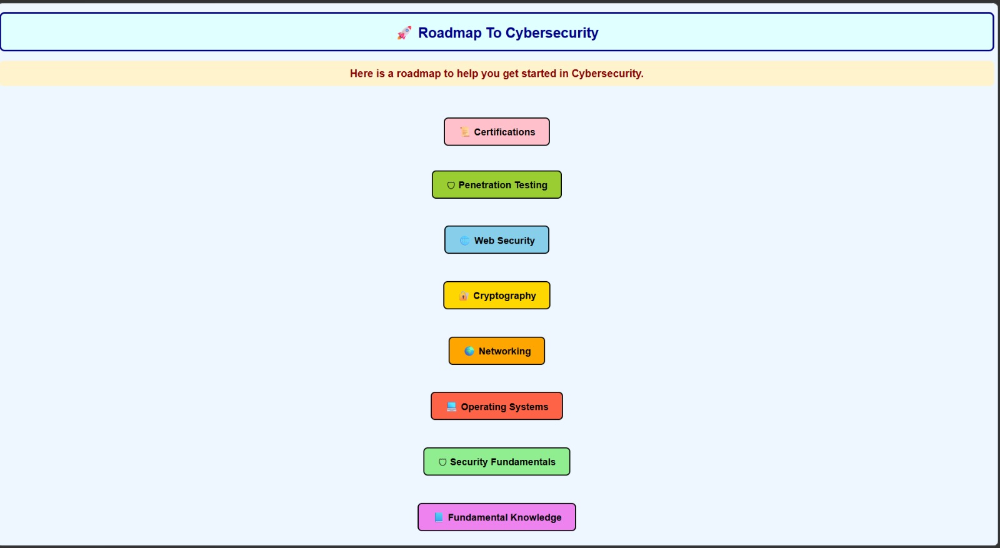
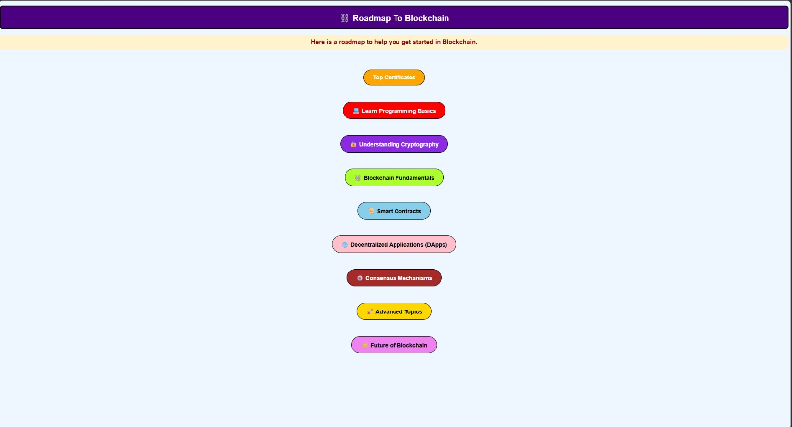
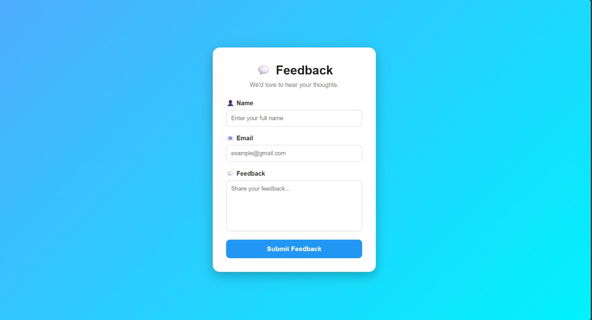
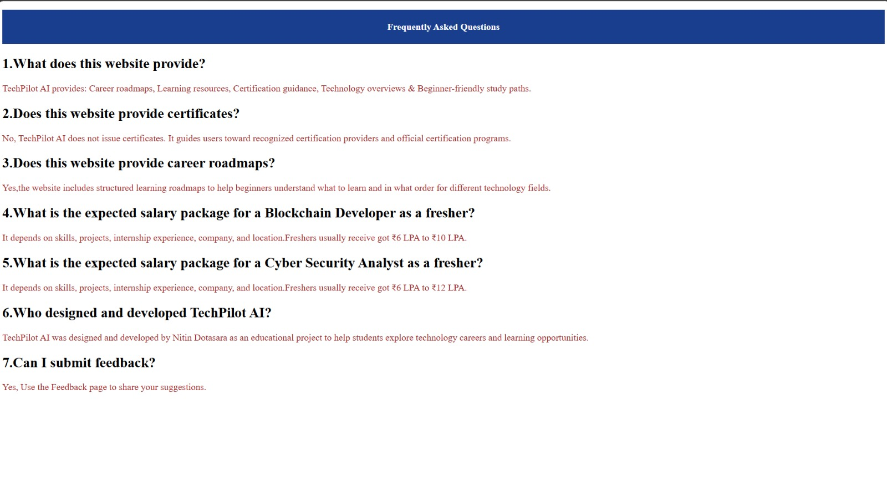
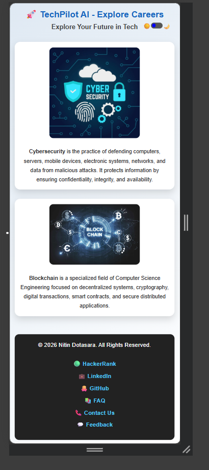

# 🚀 TechPilot AI

<p align="center">A responsive career guidance web application built using <b>Flask</b>, <b>Python</b>, <b>HTML</b>, and <b>CSS</b> to help students explore career opportunities in <b>Cybersecurity</b> and <b>Blockchain</b>.
</p>

<p align="center">


</p>

---

## 🌐 Live Demo

**Website:** https://techpilot-ai.onrender.com/

---

## 📖 About the Project

TechPilot AI is a career guidance platform developed to introduce students to two rapidly growing technology domains: **Cybersecurity** and **Blockchain**.

The motivation behind this project was the belief that while Artificial Intelligence receives significant attention, Cybersecurity and Blockchain are equally important technologies that will continue to shape the future. This project aims to provide beginners with a simple starting point to explore these fields, understand career opportunities, discover recommended certifications, and access useful learning resources.

---

## ✨ Features

- 🛡️ Cybersecurity career guidance
- ⛓️ Blockchain career guidance
- 📚 Certification recommendations
- ❓ Frequently Asked Questions (FAQ)
- 💬 Feedback page
- 📧 Contact Us using the Mailto protocol
- 🌙 Dark / Light theme toggle 
- 📱 Fully responsive design
- ⚡ Flask-powered backend
- 🎨 Clean and beginner-friendly interface

---

## 🛠️ Technologies Used

### Frontend
- HTML5
- CSS3
- Jinja2 Templates

### Backend
- Python
- Flask

### Deployment
- Render

### Version Control
- Git
- GitHub

### Additional
- Mailto Protocol
- Local feedback storage using `feedback.txt`

---

## 📂 Project Structure

```
TechPilot-AI
│
├── static
│   └── style.css
│
├── templates
│   ├── indexx.html
│   ├── blockchain.html
│   ├── Cybersecurity.html
    |-- bccertificates.html
    |-- CyberCertificates.html
    |-- error.html
    |-- feedback.html
    
│
├── app.py
├── requirements.txt
└── README.md
|__ Procfile
```

---

## 🚀 Getting Started

### Clone the repository

```bash
git clone https://github.com/nitindotasara2006-bot/TechPilot-AI.git
```

### Navigate to the project directory

```bash
cd TechPilot-AI
```

### Install the dependencies

```bash
pip install -r requirements.txt
```

### Run the application

```bash
python app.py
```

Open your browser and visit:

```
http://127.0.0.1:5000/
```

---

## 📸 Screenshots

### 🏠 Homepage


---

### 🛡️ Cybersecurity Page



---

### ⛓️ Blockchain Page



---

### Feedback Form


---

### Frequently Asked Questions


---

### 📱Mobile View Homepage


---

## 📌 Current Limitations

- Feedback responses are stored locally in `feedback.txt`, so they are available only when running the application on a local machine.
- The deployed version on Render does not permanently save feedback because it does not use a database.


---

## 🚀 Future Improvements

- AI-powered career recommendations
- Database integration for feedback
- Search functionality
- User accounts
- Interactive learning resources

---

## 👨‍💻 Developer

**Nitin Dotasara**

- GitHub: https://github.com/nitindotasara2006-bot
- LinkedIn: https://www.linkedin.com/in/nitin-dotasara-a63248212/

---

## 🤝 Contributing

Suggestions, feedback, and improvements are always welcome.
Feel free to fork the repository and submit a pull request.

---

## ⭐ Support

If you found this project useful, please consider giving it a ⭐ on GitHub.

It encourages me to continue building and improving open-source projects.